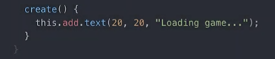

# Playlist do [Ansimuz](https://youtube.com/playlist?list=PLDyH9Tk5ZdFzEu_izyqgPFtHJJXkc79no&si=TT57fyrdWzp3MULc)
*
# Step 1 set up  e  instalando WAMP   `10:40` --- `13:00`

#### put file phaser.min.js from this [link](https://phaser.io/download/stable)
#### criar file game.js on this root directory
#### criar instancia de um jogo Phaser 
`
window.onload = function(){
  var game = new Phaser.Game()
}`
#### criar um index.html e colocar em seu head para executar os scripts recentemente criados  `game.js` e `phaser.min.js`
#### instalar web server [recomendado](https://www.wampserver.com/en/)
###### com wampserver consigo criar um servidor web com -apache2 -php -Mysql -PhpMyAdmin para facilmente gerenciar database
###### depois , colocar para acessar o servidor web local e verificar se apareceu uma tela preta e se tem erro no console.log

*
# Part 2 Phaser Scenes    `16:35` --- `17:43`
## criar uma variavel global com as caracteristicas ( largura , altura cor) passada como parâmetro pela instancia de um jogo Phaser no file `game.js` 

`var config = {
  width : 800 , 
  height: 600 , 
  backgroundColor : 0x000000 ,
}
var game = new Phaser.Game(config)` 

## scenes são as telas do jogo , posso ter varias telas executando no mesmo tempo no jogo , Cada cena vai ser criada em um arquivo separado
## criar dois file `scene1.js` e `scene2.js` e deixar ser chamado em ordem pelo index.html antes do `game.js` .
## em cada file criar a classe assim  
## ---- esta função super faz Scene1 herdar tudo da classe  `Scene` do `Phaser` 
## ---- o parametro é um identificador para cada tela/scene1 pois vamos usar ela para iniciar o jogo e a outra para o jogo 
## As telas vão ser controladas por esta sequencia de funções 
## init()   - vai preparar os dados
## preload()  - vai carregar os dados para memoria
## create()   - vai add dado como um objeto para o jogo
## update()   - é o loop executando varias vezes
## No arquivo `game.js` tem que armazenar as telas criadas dentro de uma array de telas da variavel global

## Colocando titulo na tela 1  (isso é criar um objeto texto para tela 1)

## Dentro da tela 1 faço uma call para tela 2

## Edito a tela 2 estilizando um texto diferente

