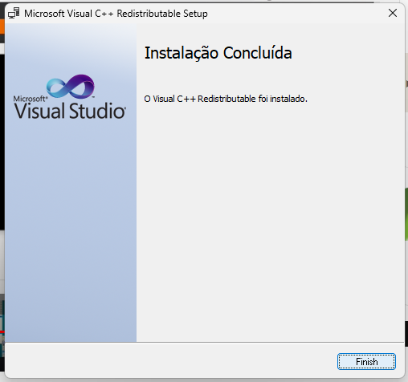

# [link](https://wampserver.aviatechno.net/) mais organizado
# [video](https://youtu.be/QXVyCunZN2s?si=bbsl2dT7mpSGno9f)
## o wamp usa umas bibliotecas do Microsoft VC++ e C , por isso tem que instalar os todos os pacotes

## emvez de baixar um por um intale todos com um executável

Os arquivos para download estão aqui: [VisualCppRedist AIO All Releases](https://github.com/abbodi1406/vcredist/releases) - A página do Github está aqui: VisualCppRedist AIO 
Baixe a versão mais recente do arquivo VisualCppRedist_AIO_x86_x64.exe e execute-o como administrador, todos os VC++ redistribuíveis necessários serão instalados e quaisquer arquivos  excedentes ou obsoletos serão removidos. Para garantir que tudo corra bem, você precisará desativar alguns aplicativos quando solicitado pelo instalador do Redist VC++.  

## pode usar um arquivo tester para saber se tem instalado todas as versões do pacote [link](https://wampserver.aviatechno.net/)
--- Visual C++ Packages --- 
To verify that all VC ++ packages are installed and with the latest versions, you can use 
the tool:[link](https://wampserver.aviatechno.net/files/tools/check_vcredist.exe) 
and you will find all the packages on [link](https://wampserver.aviatechno.net/) in section Visual C++ Redistribuable Packages 
 

## 

## ainda faltou este

# faltou pq eu baixei o x86 e nao o que deveria x64  
# quando for baixar o executavel que instala todos os pacotes VC ++ escolha esta opção

# agora vai

# depois de apertar os botões next , next escolha qual navegador vai executar o WAMP
## para selecionar o navegador tem que ir na pasta onde esta o arquivo .exe dele 
# depois escolher editor de texto vai escrever WAMP
## para achar o exe do VSCODE
## ----------Aperta no botão windowns
## ----------Pesquisar pelo nome do visual studio 
## ---------- apertar com mouse botão direito no texto que aparecer a foto do vscode
## ---------- apertar abrir local do arquivo
## ---------- e no exe que aparecer clicar nele , ser o destino em suas propriedades
## 
